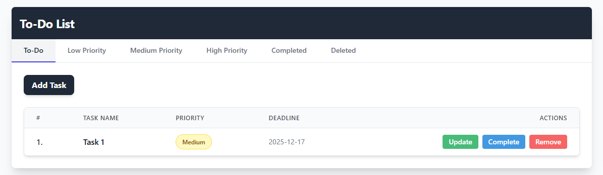
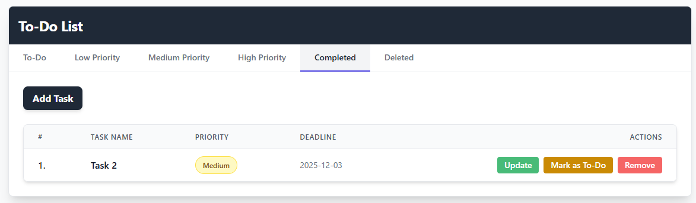
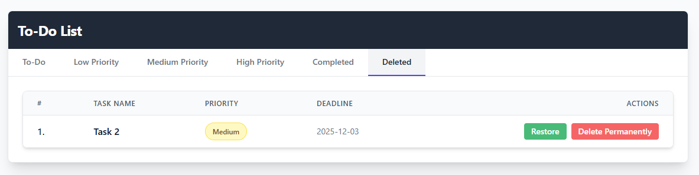

# To-Do List

A Laravel-based task management web application for creating, organizing, and tracking tasks.

The application provides task CRUD functionality along with priorities, deadlines, completion tracking, filtering, and soft deletion.

## Features

### 📝 Task Management

- Create new tasks
- Edit existing tasks
- Delete tasks
- Restore deleted tasks
- Permanently delete tasks
- Mark tasks as completed or incomplete

### ⭐ Task Priorities

Tasks can be assigned one of three priority levels:

- Low
- Medium
- High

### 📅 Deadlines

- Assign deadlines to tasks
- Display task deadlines
- Track tasks based on their current state

### 🗂️ Task Filtering

Tasks can be filtered by:

- To-Do
- Low Priority
- Medium Priority
- High Priority
- Completed
- Deleted

### 🗑️ Soft Delete

Deleted tasks use Laravel's soft-delete functionality, allowing them to be restored before being permanently removed.

## Technologies Used

- **PHP**
- **Laravel 12**
- **Blade** — server-side templating
- **Tailwind CSS** — styling
- **Vite** — frontend asset development
- **Eloquent ORM** — database interaction
- **MySQL / Relational Database** — data storage

## Screenshots

### Task List



### Completed Tasks



### Deleted Tasks



## Project Structure

```text
To-Do-List/
├── app/
├── bootstrap/
├── config/
├── database/
├── public/
├── resources/
├── routes/
├── storage/
├── tests/
├── composer.json
├── package.json
└── README.md
```

## Project Context

This project was developed as an academic web development project using the Laravel framework.

The project focuses on implementing common task management operations through a web-based interface while working with Laravel's routing, controllers, models, views, database interaction, and soft-delete functionality.

## Status

Completed academic project.
